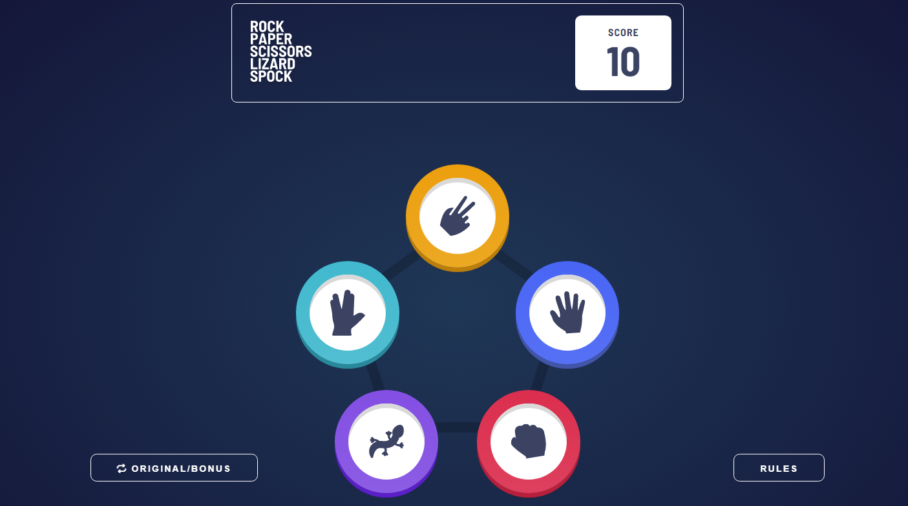

# Frontend Mentor - Rock, Paper, Scissors solution

This is a solution to the [Rock, Paper, Scissors challenge on Frontend Mentor](https://www.frontendmentor.io/challenges/rock-paper-scissors-game-pTgwgvgH). Frontend Mentor challenges help you improve your coding skills by building realistic projects.

## Table of contents

- [Overview](#overview)
  - [The challenge](#the-challenge)
  - [Screenshot](#screenshot)
  - [Links](#links)
- [My process](#my-process)
  - [Built with](#built-with)
  - [The logic](#the-logic)
- [Author](#author)

## Overview

### The challenge

Users should be able to:

- View the optimal layout for the game depending on their device's screen size
- Play Rock, Paper, Scissors against the computer
- Maintain the state of the score after refreshing the browser _(optional)_
- **Bonus**: Play Rock, Paper, Scissors, Lizard, Spock against the computer _(optional)_

### Screenshot



### Links

- Solution URL: [Add solution URL here](https://your-solution-url.com)
- Live Site URL: [Add live site URL here](https://your-live-site-url.com)

## My process

### Built with

- Semantic HTML5 markup
- CSS custom properties
- Flexbox
- CSS Grid
- Mobile-first workflow
- JavaScript
- React

### The logic

This time I implemented the same game with React. I reused a lot from the previous game with plain javascript. I reused all the styles, some of the logic and some utilities. I also created some other utilities.

I found the implementation with React a lot easier than with plain JavaScript - it is so good to code using React. Also, separating the code into files is so good, everything gets so organized.

In this part I got a little confused because it was throwing an Error saying "cannot read properties of null", but then I remembered that each render has a snapshot of the state which does not change after we set the state. So this was the solution:

```js
function handlePick(pickedGesture) {
  setPlayerGesture(pickedGesture);
  setStatus("house_picking");

  setTimeout(() => {
    const newHouseGesture = getRandomItem(gestures);
    setHouseGesture(newHouseGesture);

    setTimeout(() => {
      let newStatus;
      if (pickedGesture.beats(newHouseGesture)) {
        newStatus = "won";
      } else if (newHouseGesture.beats(pickedGesture)) {
        newStatus = "lost";
      } else {
        newStatus = "tie";
      }

      onEnd(newStatus);
      setStatus(newStatus);
    }, 1000);
  }, 750);
}
```

I removed the "house_picked" state because it was kind of unnecessary really. There are only these ones now:

```js
const isPicking = status === "picking";
const isHousePicking = status === "house_picking";
const isFinished = status === "lost" || status === "won" || status === "tie";

return (
  <div className="game">
    {isPicking && <Pick gestures={gestures} onPick={handlePick} />}
    {isHousePicking && (
      <Choices playerGesture={playerGesture} houseGesture={houseGesture} />
    )}
    {isFinished && (
      <FinalScreen
        status={status}
        playerGesture={playerGesture}
        houseGesture={houseGesture}
        onPlayAgain={handlePlayAgain}
      />
    )}
  </div>
);
```

This is a lot easier to understand I guess.

I also gave other names to some components:

```js
function Choices({ playerGesture, houseGesture }) {
  return (
    <div className="two-gesture-container">
      <Gesture gesture={playerGesture} />
      <p className="player-pick-message pick-message">You picked</p>
      <Gesture gesture={houseGesture} />
      <p className="house-pick-message pick-message">The house picked</p>
    </div>
  );
}

function FinalScreen({ status, playerGesture, houseGesture, onPlayAgain }) {
  let message;
  if (status === "won") {
    message = "You win";
  } else if (status === "lost") {
    message = "You lose";
  } else {
    message = status;
  }

  return (
    <div className="game-conclusion">
      <Gesture gesture={playerGesture} />
      <Gesture gesture={houseGesture} />
      <p className="player-pick-message pick-message">You picked</p>
      <p className="house-pick-message pick-message">The house picked</p>
      <div className="message-container">
        <p className="message">{message}</p>
        <button className="btn secondary-btn" onClick={onPlayAgain}>
          Play again
        </button>
      </div>
    </div>
  );
}
```

## Author

- Frontend Mentor - [@rafaeldevvv](https://www.frontendmentor.io/profile/rafaeldevvv)
- Twitter - [@rafaeldevvv](https://www.twitter.com/rafaeldevvv)
- Instagram - [@rafaeldevvv](https://www.instagram.com/rafaeldevvv)
